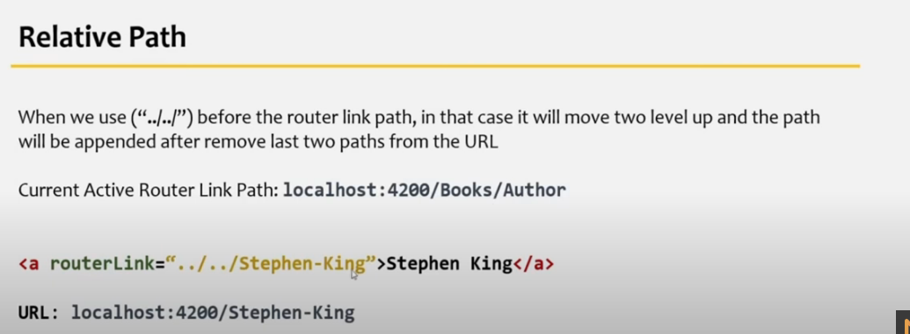

1. How to Define Routes?

Create a new route using Routes Array and define some routes inside array
Register the route using RouterModule.forRoot(route)
Now use <router-outlet> where you want to render the view of specified component.

2. How to Implement NotFoundRoute?

Using WildCard route , specified using ** and must be given at the end of all routes.It matches every URL, the router will select this route if it can't match a route earlier in the configuration.

3. WHat is RouterLink directive?

It binds HTML element to route. When applied to an element in a template, makes that element a link that initiates navigation to a route. We can pass additional parameters to it also. It overrides the default behaviour of anchor tag <a>.

4. WHat is RouterLinkActive Directive?

Tracks whether the linked route of an element is currently active, and allows you to specify one or more CSS classes to add to the element when the linked route is active.

5. WHat is RouterLinkActiveOptions Directive?

When a child route is active, its parent route is also active. In that case routerLinkactive is applied to active child route as well as parent route. To resolv this we have to use this RouterLinkActive Directive. [routerLinkActiveOptions]="{exact:true}

6. What is Absolute path?

7. What is Relative path?

